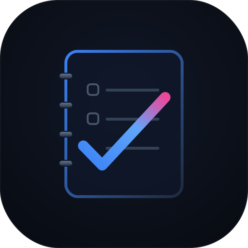

<div align="center">

  

  # 🌟 TrueTask

  ### **The Ultimate Frosted-Glass Tasks & Daily Habits Workspace**

  *A premium, high-fidelity Progressive Web Application (PWA) designed to track academic assignments, organize tasks, and maintain daily habit consistency with 100% offline-first capability.*

  ---

  [](#)
  [](#)
  [](#)
  [](#)
  [](#)

  ---

</div>

## 🌌 Project Essence

TrueTask is a state-of-the-art, glassmorphic space-slate dashboard that bridges the gap between academic progress and personal daily habits. Featuring fluid animations, native drag-and-drop mechanics, dynamic SVG area line charts, and an elegant context-aware UI, TrueTask offers a stunning aesthetic experience without relying on any external CSS libraries, compilers, or live servers.

---

## ✨ Features That Wow

### 🔄 Dual-Action Workspace Morphing
Seamlessly transition between Academic Tasks and Daily Routines. TrueTask morphs its layout dynamically:
*   **Academic Mode:** Displays task counts, **COURSES** customization selectors, academic timeline filters, and the Completed Archives drawer launcher.
*   **Daily Routines Mode:** Changes stats cards into a **Routine Statistics** summary (streaks, perfect days, habit ratio), swaps courses for dynamic **CATEGORIES** list filters, and updates the footer navigation to fade out archiving controls for a focused mind.

### 📐 Interactive Eisenhower Decision Matrix
*   Intuitively divides tasks into **four priority quadrants**:
    *   `Q1` — 🔴 **Urgent & Important** (Do Immediately)
    *   `Q2` — 🟡 **Important & Not Urgent** (Plan & Schedule)
    *   `Q3` — 🔵 **Urgent & Not Important** (Quick Delegate)
    *   `Q4` — 🟢 **Not Urgent & Not Important** (Eliminate/Backlog)
*   **Native Drag & Drop:** Grab tasks and drop them directly into new quadrants. Priority states and visual color schemes transition instantly.

### 📈 Dynamic SVG Area Line Chart
*   A full-width, glassmorphic rolling **Weekly Consistency Graph**.
*   Built using native browser SVG nodes and vector path rendering.
*   Features dashed horizontal grids (`0%`, `50%`, `100%`), linear neon gradient strokes, transparent area fills, glowing trend markers, and hover tooltips showing precise completion ratios.

### 🏷️ Dynamic Sidebar Category & Course Managers
*   Create and customize courses or habit categories directly from the sidebar.
*   Select tailored color themes and watch the dynamic active counts compute in real-time.
*   Includes built-in validation preventing deletion of the core default categories (`💻 Coding`, `🏃 Health`, `📚 Learning`, `⚙️ Daily Life`).

### 📱 Full PWA Desktop Installation
*   **Installable App:** Manifest and vector bindings allow you to install TrueTask directly onto your system dock as a native standalone application.
*   **Service Worker Caching:** Integrates `sw.js` managing cache strategies for instant load times and complete offline viability.

---

## 🎨 Premium Visual Palette

TrueTask is built using custom HSL design tokens, frosted-glass filters (`backdrop-filter: blur`), glowing box-shadow borders, and micro-interactive cursor highlights:

| Element | Style Specification |
| :--- | :--- |
| **Theme Base** | Space-slate dark theme (`#090d16` to `#0d1527` gradient overlay) |
| **Cards** | Translucent frost borders with elegant 1px glass overlays |
| **Streaks** | Neon warning gradients (`#f59e0b` to `#ef4444`) |
| **Fonts** | Outfit geometric sans-serif stack |

---

## 📂 Modular Structure

```bash
├── index.html     
├── styles.css     
├── app.js         
├── manifest.json  
├── sw.js          
├── icon.svg       
└── README.md      
```

---

## 🚀 How to Run the App

Since TrueTask relies exclusively on native clientside standard browser modules, **no local server, Node modules, or package installation steps are required**.

### 💻 Direct Double-Click (Zero Install)
Simply open the file [index.html](index.html) directly inside your preferred web browser.

### 🌐 Lightweight Local Server (Optional)
If you prefer testing local cache-first registers under active service workers, deploy a server:
```bash
npx serve .
# or
python3 -m http.server 8000
```
Then, visit `http://localhost:8000` in your browser.